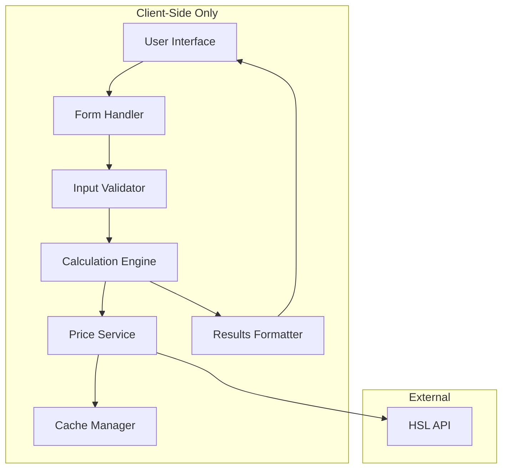

# Design Document

## Overview

The HSL Ticket Optimizer is a client-side single-page application that helps users find the most cost-effective public transport ticket option. The application fetches real-time pricing from HSL's CMS API, processes user input about travel patterns, and calculates monthly costs for different ticket types.

The application follows a modular architecture with clear separation between data fetching, business logic, and presentation layers. All processing happens client-side to maintain compatibility with GitHub Pages hosting.

## Architecture

### High-Level Architecture



### Technology Stack

- **Frontend Framework**: Vanilla JavaScript (ES6+) with modern browser APIs
- **Styling**: CSS3 with CSS Grid/Flexbox for responsive layout
- **HTTP Client**: Fetch API for HSL API integration
- **Storage**: localStorage for price caching
- **Testing**: Jest for unit tests, Testing Library for integration tests
- **Build**: Vite for development and production builds
- **Deployment**: GitHub Pages with GitHub Actions

## Components and Interfaces

### 1. Price Service (`PriceService`)

Handles all HSL API interactions and price data management.

```javascript
interface PriceService {
  fetchTicketPrices(zones: string, customerGroup: number): Promise<TicketPrices>
  getCachedPrices(zones: string): TicketPrices | null
  setCachedPrices(zones: string, prices: TicketPrices): void
  isCacheValid(timestamp: number): boolean
}

interface TicketPrices {
  single: number
  series: { price: number, journeys: number, validityDays: number }
  monthly: number
  continuousMonthly: number
  timestamp: number
}
```

**API Endpoints:**
- Single tickets: `https://cms.hsl.fi/api/v1/tickets/single?language=fi&customerGroup=1&zones={zones}`
- Series tickets: `https://cms.hsl.fi/api/v1/tickets/series?language=fi&customerGroup=1&zones={zones}`
- Monthly tickets: `https://cms.hsl.fi/api/v1/tickets/monthly?language=fi&customerGroup=1&zones={zones}`

### 2. Calculation Engine (`CalculationEngine`)

Core business logic for cost calculations and comparisons.

```javascript
interface CalculationEngine {
  calculateMonthlyCosts(input: UserInput, prices: TicketPrices): CalculationResults
  calculateSingleTicketCost(tripsPerWeek: number, singlePrice: number): number
  calculateSeriesTicketCost(tripsPerWeek: number, seriesData: SeriesTicket): SeriesCalculation
  calculateMonthlyTicketCost(monthlyPrice: number): number
  findOptimalOption(results: CalculationResults): string
}

interface UserInput {
  selectedTicketTypes: string[]
  zones: string
  tripsPerWeek: number
}

interface CalculationResults {
  single?: CostBreakdown
  series?: SeriesCalculation
  monthly?: CostBreakdown
  continuousMonthly?: CostBreakdown
  optimal: string
}

interface CostBreakdown {
  monthlyCost: number
  calculation: string
  annualCost: number
}

interface SeriesCalculation extends CostBreakdown {
  ticketsNeeded: number
  journeysWasted: number
  wasteWarning?: string
}
```

### 3. Form Handler (`FormHandler`)

Manages user input, validation, and form state.

```javascript
interface FormHandler {
  validateInput(input: UserInput): ValidationResult
  handleFormSubmit(event: Event): void
  updateZoneOptions(): void
  resetForm(): void
}

interface ValidationResult {
  isValid: boolean
  errors: string[]
}
```

### 4. Results Formatter (`ResultsFormatter`)

Formats and displays calculation results to users.

```javascript
interface ResultsFormatter {
  formatResults(results: CalculationResults): HTMLElement
  formatCostBreakdown(breakdown: CostBreakdown): string
  formatSeriesWarning(seriesCalc: SeriesCalculation): string
  highlightOptimalOption(results: CalculationResults): void
}
```

### 5. Cache Manager (`CacheManager`)

Handles browser storage for price caching.

```javascript
interface CacheManager {
  get(key: string): any
  set(key: string, value: any, ttl: number): void
  isExpired(key: string): boolean
  clear(): void
}
```

## Data Models

### HSL API Response Models

Based on HSL API structure, the responses will be normalized to:

```javascript
// Single ticket API response
interface HSLSingleResponse {
  data: {
    price: number
    currency: string
    zones: string
  }
}

// Series ticket API response  
interface HSLSeriesResponse {
  data: {
    price: number
    journeys: number
    validityDays: number
    currency: string
    zones: string
  }
}

// Monthly ticket API response
interface HSLMonthlyResponse {
  data: {
    price: number
    currency: string
    zones: string
  }
}
```

### Internal Data Models

```javascript
interface TicketOption {
  type: 'single' | 'series' | 'monthly' | 'continuousMonthly'
  name: string
  enabled: boolean
}

interface ZoneOption {
  value: string
  label: string
  description: string
}

const ZONE_OPTIONS: ZoneOption[] = [
  { value: '12', label: 'AB', description: 'Helsinki, Espoo, Vantaa, Kauniainen' },
  { value: '123', label: 'ABC', description: 'AB + Kerava, Kirkkonummi, Sipoo' },
  { value: '1234', label: 'ABCD', description: 'ABC + Tuusula, Nurmijärvi' },
  // ... other zones
]
```

## Error Handling

### API Error Handling Strategy

1. **Network Errors**: Display user-friendly message and disable calculations
2. **Invalid Responses**: Log error and show fallback message
3. **CORS Issues**: Provide clear instructions for user
4. **Rate Limiting**: Implement exponential backoff

```javascript
class APIError extends Error {
  constructor(message, type, originalError) {
    super(message)
    this.type = type // 'network', 'cors', 'invalid_response', 'rate_limit'
    this.originalError = originalError
  }
}

const ERROR_MESSAGES = {
  network: 'Unable to connect to HSL services. Please check your internet connection.',
  cors: 'Browser security settings are blocking the request. Please try refreshing the page.',
  invalid_response: 'Received invalid data from HSL services. Please try again later.',
  rate_limit: 'Too many requests. Please wait a moment before trying again.'
}
```

### Form Validation Errors

```javascript
const VALIDATION_RULES = {
  tripsPerWeek: {
    required: true,
    min: 1,
    max: 50,
    type: 'integer'
  },
  zones: {
    required: true,
    validValues: ['12', '123', '1234', '234', '34', '4']
  },
  ticketTypes: {
    required: true,
    minSelected: 1
  }
}
```

## Testing Strategy

### Unit Tests

1. **Calculation Engine Tests**
   - Test cost calculations for each ticket type
   - Test edge cases (very low/high trip frequencies)
   - Test series ticket waste calculations
   - Test optimal option selection logic

2. **Price Service Tests**
   - Mock HSL API responses
   - Test caching functionality
   - Test error handling scenarios
   - Test cache expiration logic

3. **Form Validation Tests**
   - Test input validation rules
   - Test error message generation
   - Test form state management

### Integration Tests

1. **End-to-End User Flows**
   - Complete form submission and result display
   - Error handling user experience
   - Cache behavior across sessions

2. **API Integration Tests**
   - Test with actual HSL API (in development)
   - Test CORS handling
   - Test response parsing

### Test Data

```javascript
const MOCK_PRICES = {
  zones12: {
    single: 2.95,
    series: { price: 27.00, journeys: 10, validityDays: 14 },
    monthly: 64.70,
    continuousMonthly: 61.50
  }
}

const TEST_SCENARIOS = [
  { tripsPerWeek: 2, expectedOptimal: 'single' },
  { tripsPerWeek: 8, expectedOptimal: 'series' },
  { tripsPerWeek: 15, expectedOptimal: 'monthly' },
  { tripsPerWeek: 20, expectedOptimal: 'continuousMonthly' }
]
```

## Performance Considerations

### Caching Strategy
- Cache HSL API responses for 1 hour in localStorage
- Implement cache versioning for API changes
- Clear expired cache automatically

### API Optimization
- Batch API requests when possible
- Implement request deduplication
- Use AbortController for request cancellation

### Bundle Optimization
- Tree-shake unused code
- Minimize CSS and JavaScript
- Use modern browser features (no polyfills for GitHub Pages)

## Security Considerations

### Client-Side Security
- Validate all user inputs
- Sanitize data before display
- Use HTTPS for all API requests
- No sensitive data storage

### API Security
- Use only public HSL API endpoints
- No API keys or authentication required
- Handle CORS appropriately

## Deployment Configuration

### GitHub Pages Setup
```yaml
# .github/workflows/deploy.yml
name: Deploy to GitHub Pages
on:
  push:
    branches: [ main ]
jobs:
  deploy:
    runs-on: ubuntu-latest
    steps:
      - uses: actions/checkout@v3
      - uses: actions/setup-node@v3
      - run: npm ci
      - run: npm run build
      - run: npm test
      - uses: actions/deploy-pages@v1
```

### Build Configuration
```javascript
// vite.config.js
export default {
  base: '/hsl-ticket-optimizer/',
  build: {
    outDir: 'dist',
    assetsDir: 'assets'
  }
}
```
